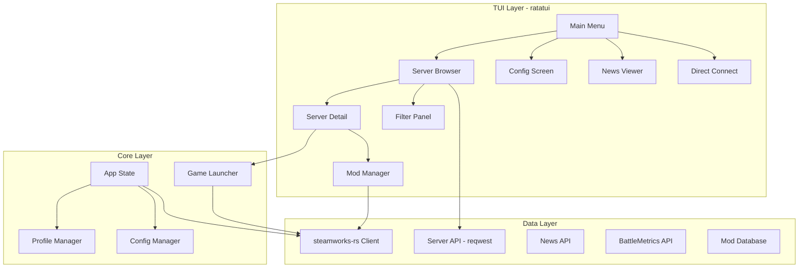

# Rewrite dayz-ctl in Rust with ratatui + steamworks-rs

## Current State

The project is a single ~1700-line Bash script ([dayz-ctl](dayz-ctl)) that acts as a DayZ server browser and launcher for Linux. It uses:
- **gum** (Charm) for menus, prompts, spinners
- **fzf** for fuzzy server list with live preview
- **SteamCMD** for workshop mod downloads
- **dayzsalauncher.com API** for the server list
- **Steam Web API** for player counts
- **jq** for JSON, **geoiplookup/whois** for geo, **ping** for latency

## Architecture



## Key Design Decisions

- **Server list source**: Keep using the dayzsalauncher.com HTTP API -- it provides a comprehensive, pre-aggregated server list. steamworks-rs `matchmaking` only wraps lobbies, not `ISteamMatchmakingServers`. We can optionally add the `a2s` crate later for live per-server queries (real-time player count, ping).

- **Mod downloads**: Replace SteamCMD entirely with steamworks-rs UGC (User Generated Content) API. `client.ugc()` can subscribe to and download workshop items natively, which is cleaner than shelling out to steamcmd.

- **Fuzzy search**: Use the `nucleo` crate (same engine powering Helix editor's picker) to replace fzf's fuzzy matching in the server browser.

- **Async**: Use `tokio` for HTTP requests and background data loading. steamworks-rs is callback-based (call `client.run_callbacks()` periodically), so Steam operations run on a dedicated thread.

- **TUI pattern**: Use ratatui's standard architecture -- an `App` struct with screen enum, crossterm event loop, and per-screen render/input handlers.

## Project Structure

```
dayz-ctl-rs/
  Cargo.toml
  steam_appid.txt              # Contains "221100"
  src/
    main.rs                    # Entry point, arg parsing, terminal setup
    app.rs                     # App state machine, event loop
    event.rs                   # Input/tick event system
    config.rs                  # Config file (dayz-ctl.conf equivalent)
    profile.rs                 # Profile JSON (favorites, history, options)
    steam/
      mod.rs                   # Steam client init + callback thread
      workshop.rs              # UGC: subscribe, download, status
    api/
      mod.rs                   # HTTP client setup
      servers.rs               # dayzsalauncher.com server list fetch
      news.rs                  # dayz.com news API
      battlemetrics.rs         # BattleMetrics server lookup
    server/
      mod.rs
      types.rs                 # Server, ServerFilter, enums
      filter.rs                # Filter logic (map, mods, players, etc.)
    mods/
      mod.rs
      types.rs                 # Mod info types
      manager.rs               # Scan installed, symlink, remove
    launch.rs                  # Build args, spawn steam, wait for process
    ui/
      mod.rs                   # Screen enum, shared render helpers
      theme.rs                 # Colors, styles, borders
      main_menu.rs             # Main menu screen
      server_browser.rs        # Server list + fuzzy search + preview
      server_detail.rs         # Detail view after selecting server
      filter.rs                # Multi-select filter dialog
      config_screen.rs         # Config menu
      news.rs                  # News article list/viewer
      direct_connect.rs        # IP/port input dialog
      input.rs                 # Text input widget wrapper
      popup.rs                 # Confirm/alert dialogs
```

## Dependencies (Cargo.toml)

```toml
[package]
name = "dayz-ctl"
version = "0.3.0"
edition = "2024"

[dependencies]
ratatui = "0.29"
crossterm = "0.28"
steamworks = "0.12"
tokio = { version = "1", features = ["full"] }
reqwest = { version = "0.12", features = ["json"] }
serde = { version = "1", features = ["derive"] }
serde_json = "1"
nucleo = "0.5"
clap = { version = "4", features = ["derive"] }
anyhow = "1"
thiserror = "2"
chrono = { version = "0.4", features = ["serde"] }
directories = "6"
tracing = "0.1"
tracing-subscriber = "0.3"
tui-input = "0.11"
open = "5"                    # xdg-open replacement
surge-ping = "0.8"            # ICMP ping
maxminddb = "0.25"            # GeoIP (optional, with bundled DB)
```

## Feature Mapping (Bash to Rust)

- **Main menu** (gum choose) --> ratatui `List` widget with highlight, keyboard nav
- **Server browser** (fzf + preview) --> Split layout: left panel with fuzzy-searchable `Table`, right panel with server detail. `nucleo` for matching.
- **Server filters** (gum choose --no-limit) --> Multi-select list with checkboxes, popup dialogs for value inputs
- **Favorites/History** --> Same server browser but filtered from `profile.json`
- **Direct connect** --> Text input dialog (IP + port fields)
- **Config** --> Menu list with sub-dialogs for each option
- **News** --> Scrollable text view with article list
- **Mod install** --> Progress bar/spinner during download via steamworks UGC
- **Game launch** --> `std::process::Command` to run `steam -applaunch 221100 ...`
- **Desktop entries** --> Write `.desktop` files with `std::fs`
- **GeoIP/Ping** --> `maxminddb` + `surge-ping` (or `dns-lookup` + raw socket)
- **Profile** --> serde structs, read/write JSON

## Implementation Phases

### Phase 1 -- Scaffolding and Core Types
Set up the Cargo project, define all core data types (Server, Mod, Profile, Config, LaunchOptions), implement config/profile persistence, and create the basic ratatui event loop with screen navigation.

### Phase 2 -- Data Layer
Implement server list fetching from dayzsalauncher.com API via reqwest, news API, mod database scanning (read `meta.cpp` from workshop folders), and caching with TTL.

### Phase 3 -- Steam Integration
Initialize steamworks-rs client, implement workshop item download/subscribe via UGC API, get player count, and handle the callback pump on a background thread.

### Phase 4 -- TUI Screens
Build all UI screens: main menu, server browser with fuzzy search and split-pane detail, filter panel, config screen, news viewer, direct connect dialog, mod status display.

### Phase 5 -- Game Launch and Mod Management
Implement mod symlink management (`@workshopId` symlinks in DayZ dir), build launch argument construction, process spawning via `steam -applaunch`, and process detection.

### Phase 6 -- Polish
Favorites/history management, desktop entry generation, offline mode (DayZCommunityOfflineMode), error handling, logging, and CLI mode (`dayz-ctl connect IP PORT`).
